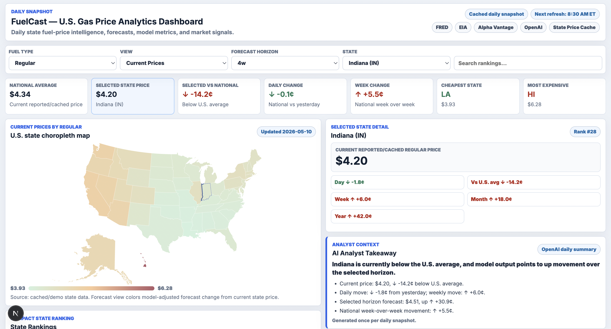
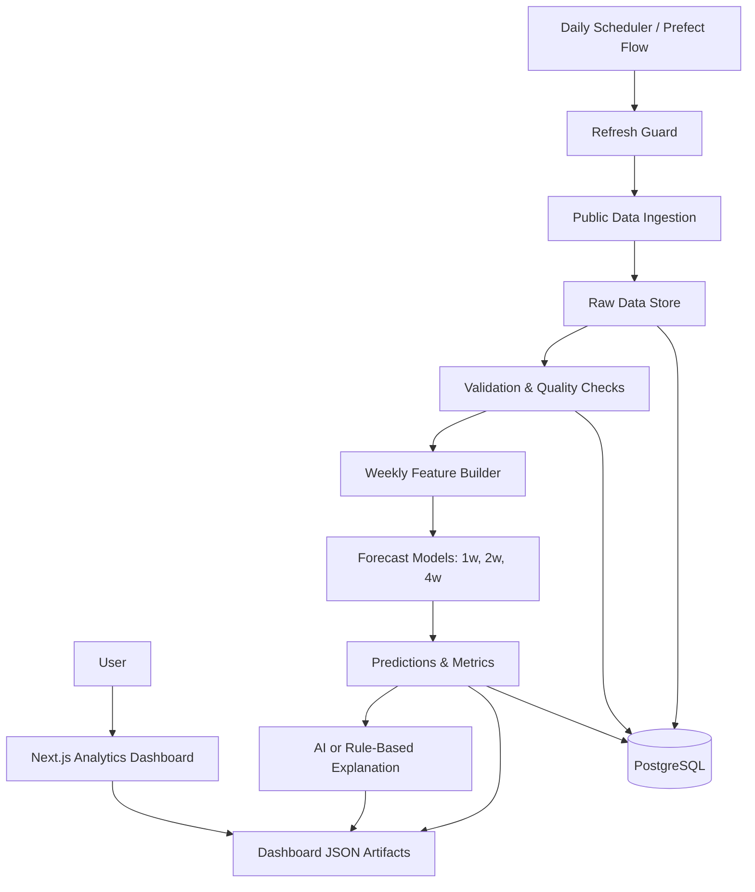

# FuelCast Showcase

FuelCast is a daily energy intelligence and forecasting system for U.S. gasoline prices, combining public energy data, time-series modeling, AI-assisted explanations, and a polished analytics dashboard.

> This repository is a public-facing showcase only. It documents the product, architecture, and engineering approach without exposing the private application source code, proprietary implementation details, credentials, raw datasets, database schema, or reusable business logic.

## Product Overview

FuelCast turns fragmented energy and market data into a daily decision-support snapshot. The private project ingests public data sources, validates observations, trains multi-horizon forecasting models, generates grounded forecast explanations, and publishes dashboard-ready analytics for national and state-level gasoline price trends.

The experience is designed like a production analytics tool rather than a static notebook: every run records refresh state, model outputs, validation status, and dashboard artifacts so the user can tell whether the current view came from a live refresh or a cached daily snapshot.

## Why I Built It

Gas prices are familiar, volatile, and influenced by multiple overlapping signals. I built FuelCast to demonstrate an end-to-end analytics system that connects data engineering, forecasting, orchestration, AI explanation, and frontend product design in one practical project.

## Problem It Solves

Public fuel-price data is available, but it is spread across separate APIs and usually requires manual interpretation. FuelCast consolidates that information into a single workflow that answers:

- What is happening to U.S. gasoline prices right now?
- How are prices changing by state?
- What does the model forecast for 1, 2, and 4 weeks ahead?
- How accurate has the model been by forecast horizon?
- Which market signals are relevant context without overstating causation?

## Target Users

- Analysts monitoring consumer fuel-price trends
- Data teams evaluating automated forecasting workflows
- Operators who need a daily snapshot instead of ad hoc API pulls
- Recruiters and engineering teams assessing full-stack data product work

## Core Features

- Daily refresh guard to protect API limits and keep demos reproducible
- Public energy and market data ingestion from sources such as FRED, EIA, Alpha Vantage, and state-level fuel-price feeds
- Commodity-aware data validation and raw observation preservation
- PostgreSQL-backed storage with CSV/local fallback behavior
- Weekly feature generation with lag, rolling, crude-price, and market-context signals
- Separate 1-week, 2-week, and 4-week gasoline price forecasts
- Time-series-safe train/test evaluation with naive baseline comparison
- AI-assisted forecast explanation with deterministic rule-based fallback
- Next.js analytics dashboard backed by generated JSON artifacts
- U.S. state choropleth map with current, daily, weekly, monthly, and forecast views
- State rankings, top movers, national overview, model metrics, and pipeline health panels

## Screenshots

## Feature Walkthrough

1. The user opens the dashboard and immediately sees national gasoline price context, latest forecast values, data freshness, and source status.
2. The map can switch between current prices and change-based views, making regional trends visible without reading every row.
3. Forecast cards communicate 1-week, 2-week, and 4-week model outputs separately because uncertainty and signal strength vary by horizon.
4. State rankings let the user compare prices, recent changes, and adjusted forecast estimates across the country.
5. The AI analyst panel explains the forecast using only generated FuelCast signals and falls back to deterministic language when AI services are unavailable.
6. Pipeline health and validation panels make the system inspectable, not opaque.

## Tech Stack

| Layer | Technologies |
| --- | --- |
| Frontend | Next.js, React, TypeScript, SVG map visualization |
| Data pipeline | Python, pandas, NumPy, requests |
| Modeling | scikit-learn, joblib, time-series evaluation |
| Storage | PostgreSQL, SQLAlchemy, CSV artifact fallback |
| Orchestration | Prefect, local daily scheduling |
| AI/LLM | OpenAI-generated explanation with rule-based fallback |
| DevOps | Docker, Docker Compose, GitHub Actions |
| Quality | pytest, ruff, validation checks, run metadata |

## Architecture Overview

FuelCast follows a batch analytics architecture. A daily orchestration layer checks whether the system has already refreshed for the local calendar day. If a refresh is needed, the pipeline ingests public source data, normalizes it, validates it, persists raw and processed outputs, trains forecast models, generates an explanation, and exports dashboard artifacts.

## Data Flow Overview

1. Public APIs provide fuel, crude oil, petroleum, and market-context data.
2. Raw observations are normalized and preserved before modeling.
3. Validation rules check missing values, duplicates, unrealistic values, and commodity-specific constraints.
4. Daily crude data is resampled into weekly features aligned with weekly gas prices.
5. Lag and rolling features are created without shuffling time-series rows.
6. Separate models forecast 1, 2, and 4 weeks ahead.
7. Model metrics, predictions, explanations, and refresh metadata are exported for the dashboard.

## AI/ML And Automation Components

- Forecasting uses supervised regression models evaluated with a time-based split.
- Each horizon is modeled separately to reflect different signal behavior over time.
- A naive baseline is tracked so the selected model must be interpreted relative to a simple benchmark.
- AI explanation is constrained to FuelCast-generated metrics and signals.
- A rule-based explanation path keeps the product usable when LLM access is unavailable.
- Automation is handled as a daily batch workflow rather than constant polling.

## Engineering Highlights

- Built as an inspectable analytics pipeline with explicit run metadata
- Designed for graceful degradation when APIs, PostgreSQL, or AI services are unavailable
- Separates raw, processed, model, explanation, and dashboard artifact layers
- Uses commodity-aware validation, including historically valid edge cases
- Keeps forecast communication careful by labeling market signals as context, not causation
- Presents model uncertainty through horizon-specific metrics and ranges
- Uses static dashboard artifacts to simplify deployment and improve demo reliability

## Security, Privacy, And IP Notice

This showcase intentionally excludes:

- Private application source code
- API keys, tokens, environment files, and secrets
- Database schema details and connection strings
- Raw/private datasets and generated model artifacts
- Proprietary data transformation logic
- Client or user data
- Any files that would allow someone to clone and run the private system

## What I Learned

FuelCast reinforced the importance of designing data products around operational reality: API limits, partial failures, stale data, explainability, and user trust matter as much as the model itself. It also showed how much polish comes from small product decisions, such as clear refresh status, careful uncertainty language, and dashboard views that support both national and state-level analysis.

## Future Improvements

- Add rolling-window backtests and drift monitoring
- Add richer regional EIA coverage and additional fuel types
- Add a lightweight API layer for authenticated dashboard reads
- Track model versions and compare candidate models over time
- Add scenario forecasting for crude-price shock assumptions
- Improve deployment with managed scheduling and observability

## Project Status

Private project complete as a portfolio-grade prototype. This public repository is documentation-only and intended for recruiter review, technical discussion, and high-level architecture demonstration.
