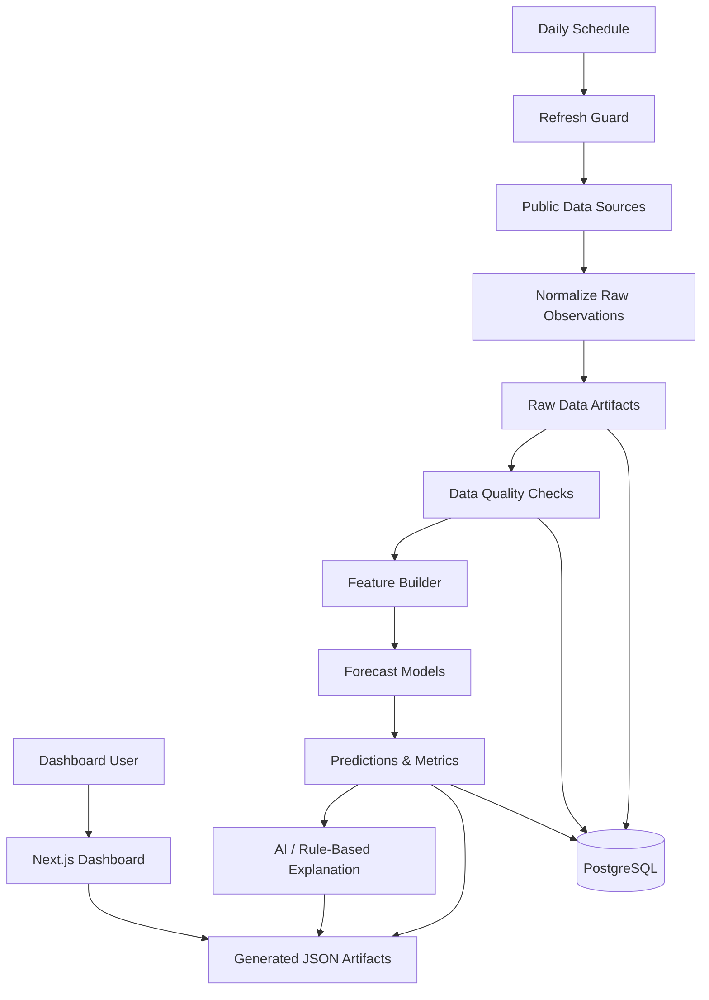

# Architecture

FuelCast uses a batch-oriented analytics architecture. The private system collects public energy and market data, validates and transforms it, trains forecast models, writes durable outputs, and serves a dashboard from generated artifacts.

This document intentionally describes the system at a high level. It does not include private source code, table definitions, credentials, exact transformation logic, or schema details.

## Frontend Layer

The frontend is a Next.js and React dashboard written in TypeScript. It reads generated JSON artifacts and presents:

- National fuel-price overview
- Forecast cards for 1-week, 2-week, and 4-week horizons
- U.S. state choropleth map
- State ranking and search controls
- Selected-state forecast comparison
- Top movers and market signals
- AI or rule-based analyst takeaway
- Pipeline health and refresh metadata

Using static dashboard artifacts keeps the presentation layer simple, fast, and reliable for demos.

## Backend / API Layer

FuelCast is primarily a scheduled data pipeline rather than a request/response API application. The backend workflow coordinates:

- Daily refresh decisioning
- Source data ingestion
- Raw data normalization
- Validation checks
- Feature generation
- Model training and prediction
- Explanation generation
- Dashboard artifact export

A future production version could add a dedicated API layer for authenticated dashboard reads.

## Data Layer

The system separates data by lifecycle:

- Raw observations are preserved after source normalization.
- Processed datasets are built for modeling.
- Predictions and metrics are exported for inspection.
- Dashboard artifacts are written as JSON.
- PostgreSQL can store source data, validation results, and model outputs when available.

The architecture also supports local artifact fallback so the project can run in constrained demo environments.

## External APIs

The private project uses public data sources for fuel, energy, and market context, including:

- Federal Reserve Economic Data for gasoline and crude-oil series
- U.S. Energy Information Administration petroleum data
- Market-context data such as ETF prices
- State-level fuel-price data or cached demonstration data

API failures are handled as expected operational events rather than fatal surprises where possible.

## AI / LLM Services

The AI component generates a daily forecast explanation from FuelCast-produced signals. It is constrained to structured project outputs such as forecast values, model metrics, source status, and market context.

The system includes a deterministic fallback explanation path so the dashboard remains useful without LLM access.

## Authentication And Security

The showcase repository does not expose authentication code, secrets, connection strings, environment files, or database schemas. In the private project, credentials are handled through environment configuration rather than committed source.

Security principles applied to the public showcase:

- No API keys or tokens
- No private implementation files
- No database schema exports
- No raw datasets or generated model artifacts
- No client or user data

## Deployment Assumptions

FuelCast is designed around a daily scheduled workflow. A typical private deployment can include:

- Containerized pipeline runtime
- PostgreSQL database
- Local or managed scheduler
- Dashboard hosting from generated artifacts
- CI checks for linting, tests, and pipeline behavior

The public showcase does not include deployable app code.

## High-Level Data Flow

## Reliability Considerations

- A once-per-day refresh guard prevents accidental API overuse.
- The pipeline records whether a view is based on live or cached data.
- Source status is surfaced in the dashboard.
- Validation results are exported alongside model outputs.
- AI failure does not block forecast display.

## Boundaries

FuelCast is a forecasting and analytics portfolio project. It is not financial advice, a fuel-purchasing recommendation engine, or a guaranteed prediction system.
